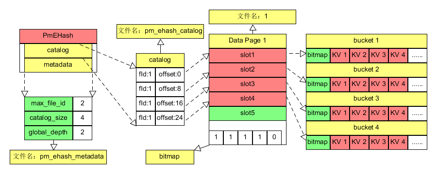

# 2020-DBMS-project
This is the final project of 2020 DBMS course in SYSU
--
## 项目概述
本次课程设计要求实现一个课本上所讲解的可扩展哈希的持久化实现，底层持久化是在模拟的NVM硬件上面进行。

## 涉及知识点
+ 可扩展哈希
+ 简单的NVM编程
+ gtest单元测试
+ 编写makefile编译
+ github团队编程
+ 定长页表设计和使用
+ 简单的页表文件空间管理

## 项目讲解
项目是一个可扩展哈希，存储定长键值对形式的数据，提供给外界的接口只有对键值对的增删改查操作，底层存储与模拟NVM硬件进行交互，将数据持久存储在文件中，重启时能够重新恢复可扩展哈希的存储状态。

## 文件夹说明：
+ data: 存放可扩展哈希的相关数据页表，目录以及元数据，即存放PmEHash对象数据文件的文件夹。**编写代码时记得将代码中的数据目录设置为这个目录**
+ gtest: Google Test源文件，不需要动
+ include: 项目相关头文件
+ PMDK-dependency: PMDK相关依赖
+ src: 项目相关源文件
+ task: 课程设计任务文档说明
+ test: 项目需要通过的测试源文件
+ workload: YCSB benchmark测试的数据集

## 项目总体步骤
1. 安装PMDK
2. 用内存模拟NVM
3. 实现代码框架的功能并进行简单的Google test，运行并通过ehash_test.cpp中的简单测试
4. 编写main函数进行YCSB benchmark测试，读取workload中的数据文件进行增删改查操作，测试运行时间并截图性能结果。

## 架构示意图


## 运行前提
- 对于gtest的TEST要求来说，存放数据的目录(默认为./data)下不能有旧哈希数据文件，所以在运行gtest前请先在test文件夹下运行make clean
- 运行gtest：在test文件夹下执行以下命令：
```
make clean 
make
sudo ./bin/ehash_test
```
- 运行ycsb性能测试：在src文件夹下运行以下命令：
```
make clean
make 
sudo ./ycsb_test
```

## 完成进度

- [x] 可扩展哈希基本功能和页表设计以及功能的实现
- [x] gtest和YCSB测试结果以及结果截图
- [x] 代码必要注释以及良好的代码风格
- [x] 完善的实验报告(必须交)

## 加分项
- [x] YCSB性能测试后，优化自己最初的设计，讲解优化原理和结果
- [ ] 多线程实现可扩展哈希并进行YCSB测试，讲解多线程实现原理并对比单线程的性能
    
    
   


